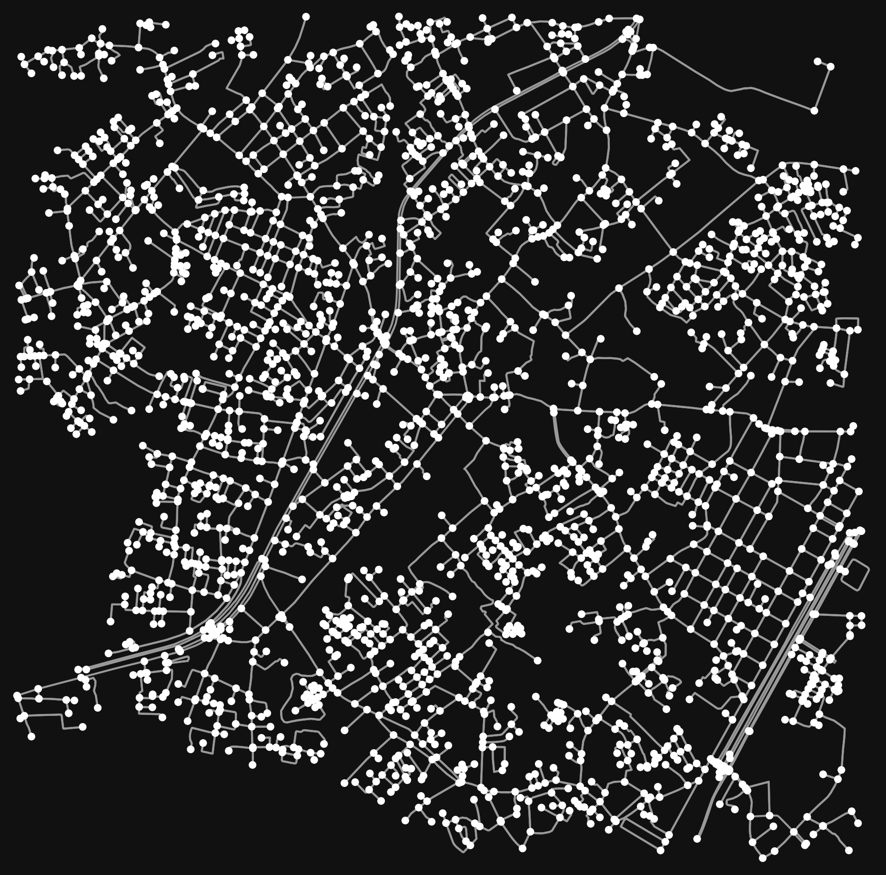

# Tìm đường ngắn nhất bằng Dijkstra trên bản đồ Thủ Đức

Bài tập Toán rời rạc: cài đặt thuật toán Dijkstra tìm đường đi ngắn nhất trên
mạng lưới đường bộ thực tế, lấy dữ liệu từ OpenStreetMap qua thư viện `osmnx`.

Khu vực khảo sát: quanh toạ độ `(10.8494, 106.7537)` — TP. Thủ Đức, TP.HCM.



## Nội dung

| File | Mô tả |
|------|-------|
| `main.py` | Ứng dụng giao diện (Tkinter + tkintermapview): bấm 2 điểm trên bản đồ để tìm đường, có nút xem hoạt ảnh mô phỏng quá trình thuật toán duyệt các cạnh. |
| `printmap.py` | Tải đồ thị đường bộ (bán kính 2 km), in số đỉnh/cạnh và vẽ ra ảnh `map.png`. |
| `map_sample.html` | Bản đồ Folium mẫu từ phiên bản cũ. |

Khi chạy, `osmnx` tự tạo thư mục `cache/` để lưu dữ liệu tải từ OpenStreetMap,
giúp các lần chạy sau nhanh hơn. Thư mục này đã được đưa vào `.gitignore`.

## Cài đặt

```bash
pip install osmnx tkintermapview
```

## Chạy

```bash
python main.py       # giao diện tương tác
python printmap.py   # vẽ mạng lưới đường ra map.png
```

Cách dùng `main.py`:

1. Bấm điểm thứ nhất trên bản đồ (điểm đầu, màu xanh).
2. Bấm điểm thứ hai (điểm đích, màu đỏ) — đường ngắn nhất được vẽ màu xanh dương.
3. Bấm **▶ Watch algorithm run** để xem hoạt ảnh các cạnh được duyệt.
4. Bấm **Clear / Reselect** để chọn lại.

## Thuật toán

Dijkstra được cài đặt thủ công bằng hàng đợi ưu tiên (`heapq`), không dùng hàm
tìm đường có sẵn của `networkx`/`osmnx`:

- Trọng số cạnh là `length` (độ dài đoạn đường, đơn vị mét) trong đồ thị OSM.
- Mỗi đỉnh lấy ra khỏi hàng đợi được đánh dấu đã xét, bỏ qua nếu gặp lại.
- Mảng `parent` dùng để truy ngược lại đường đi sau khi tới đích.
- Thứ tự các cạnh được duyệt được ghi lại để vẽ hoạt ảnh minh hoạ cách thuật
  toán lan toả ra từ điểm xuất phát.
