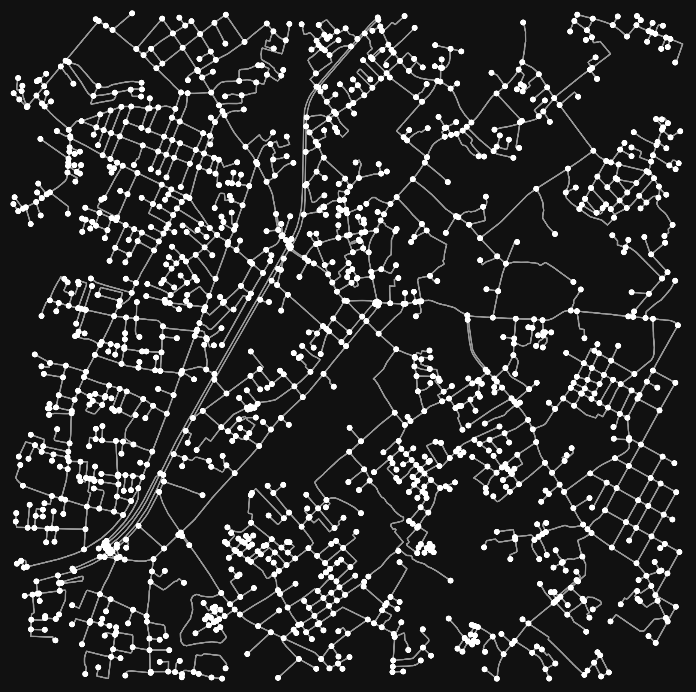

# Tìm đường ngắn nhất bằng Dijkstra trên bản đồ Thủ Đức

Bài tập Toán rời rạc: cài đặt thuật toán Dijkstra tìm đường đi ngắn nhất trên
mạng lưới đường bộ thực tế, lấy dữ liệu từ OpenStreetMap qua thư viện `osmnx`.

Khu vực khảo sát: quanh toạ độ `(10.8494, 106.7537)` — TP. Thủ Đức, TP.HCM.



## Nội dung

| File | Mô tả |
|------|-------|
| `a.py` | Ứng dụng giao diện (Tkinter + tkintermapview): bấm 2 điểm trên bản đồ để tìm đường, có nút xem hoạt ảnh mô phỏng quá trình thuật toán duyệt các cạnh. |
| `main.py` | Bản chạy dòng lệnh: tìm đường giữa 2 toạ độ cố định, xuất kết quả ra `map_sample.html` (bản đồ Folium). |
| `inmap.py` | Tải đồ thị đường bộ và vẽ ra ảnh `thuduc.png`. |
| `cache/` | Cache phản hồi từ Overpass API do `osmnx` tạo ra, giúp chạy lại không cần tải mạng. |

## Cài đặt

```bash
pip install osmnx folium tkintermapview
```

## Chạy

```bash
python a.py        # giao diện tương tác
python main.py     # xuất bản đồ ra map_sample.html
python inmap.py    # vẽ mạng lưới đường ra thuduc.png
```

## Thuật toán

Dijkstra được cài đặt thủ công bằng hàng đợi ưu tiên (`heapq`), không dùng hàm
tìm đường có sẵn của `networkx`/`osmnx`:

- Trọng số cạnh là `length` (độ dài đoạn đường, đơn vị mét) trong đồ thị OSM.
- Mỗi đỉnh lấy ra khỏi hàng đợi được đánh dấu đã xét, bỏ qua nếu gặp lại.
- Mảng `parent` dùng để truy ngược lại đường đi sau khi tới đích.

Riêng trong `a.py`, thứ tự các cạnh được duyệt còn được ghi lại để vẽ hoạt ảnh
minh hoạ cách thuật toán lan toả ra từ điểm xuất phát.
